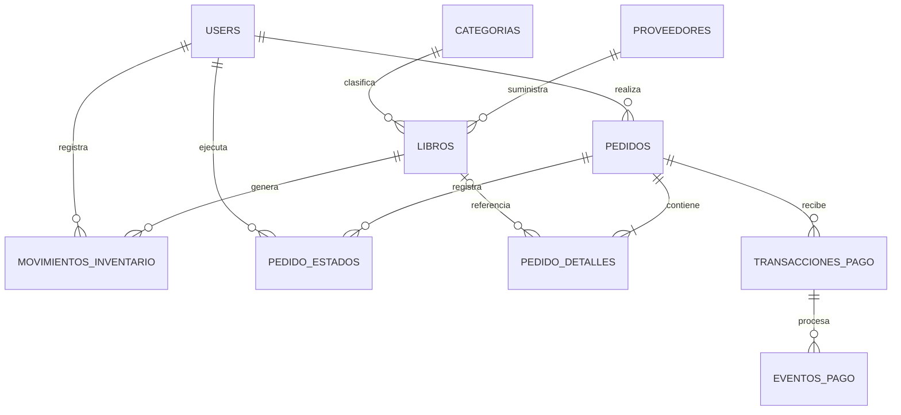
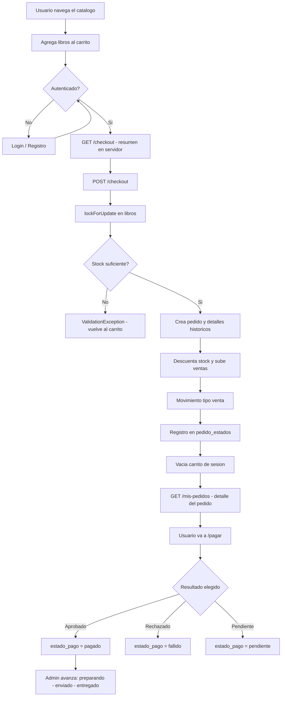

# BookShop

BookShop es una aplicacion web completa de libreria en linea construida con
**Laravel 12**. Cubre el ciclo completo de una tienda: catalogo dinamico con
filtros y busqueda, carrito de sesion, checkout transaccional con bloqueo
pesimista de stock, pedidos con precios historicos congelados, pasarela de pago
simulada con webhook firmado e idempotente, panel de administracion completo y
auditoria de inventario movimiento por movimiento.

---

## Tabla de contenidos

1. [Estado del proyecto](#1-estado-del-proyecto)
2. [Stack tecnologico](#2-stack-tecnologico)
3. [Requisitos del sistema](#3-requisitos-del-sistema)
4. [Instalacion](#4-instalacion)
5. [Variables de entorno](#5-variables-de-entorno)
6. [Usuarios y roles](#6-usuarios-y-roles)
7. [Estructura del proyecto](#7-estructura-del-proyecto)
8. [Vistas y paginas](#8-vistas-y-paginas)
9. [Rutas completas](#9-rutas-completas)
10. [Controladores y responsabilidades](#10-controladores-y-responsabilidades)
11. [Servicios](#11-servicios)
12. [Form Requests validaciones](#12-form-requests-validaciones)
13. [Componentes Blade](#13-componentes-blade)
14. [Layouts](#14-layouts)
15. [Modelo relacional](#15-modelo-relacional)
16. [Diccionario de tablas](#16-diccionario-de-tablas)
17. [Migraciones](#17-migraciones)
18. [Modelos Eloquent y relaciones](#18-modelos-eloquent-y-relaciones)
19. [Factories y Seeders](#19-factories-y-seeders)
20. [Flujo de compra](#20-flujo-de-compra)
21. [Estados del pedido y del pago](#21-estados-del-pedido-y-del-pago)
22. [Pago simulado y webhook](#22-pago-simulado-y-webhook)
23. [Inventario y auditoria](#23-inventario-y-auditoria)
24. [Correos electronicos](#24-correos-electronicos)
25. [Seguridad y consistencia](#25-seguridad-y-consistencia)
26. [Pruebas y calidad](#26-pruebas-y-calidad)
27. [Comandos utiles](#27-comandos-utiles)
28. [Solucion de problemas](#28-solucion-de-problemas)
29. [Documentacion adicional](#29-documentacion-adicional)

---

## 1. Estado del proyecto

| Modulo | Estado |
|---|---|
| Catalogo publico | Completado |
| Roles `user` y `admin` | Completado |
| Panel y CRUD administrativo | Completado |
| Carrito de sesion | Completado |
| Checkout transaccional | Completado |
| Pedidos e historial | Completado |
| Pago simulado e webhook idempotente | Completado |
| Despacho administrativo | Completado |
| Auditoria de inventario | Completado |
| Calidad y QA | En progreso |

El detalle de fases, criterios de aceptacion y proximo sprint esta en
[ROADMAP.md](ROADMAP.md).

---

## 2. Stack tecnologico

| Capa | Tecnologia |
|---|---|
| Lenguaje | PHP 8.2+ |
| Framework backend | Laravel 12 |
| ORM | Eloquent |
| Autenticacion | Laravel Breeze |
| Plantillas | Blade |
| CSS | Tailwind CSS 3 |
| Interactividad | Alpine.js 3 |
| Build frontend | Vite 7 con laravel-vite-plugin |
| Base de datos | MySQL 8+ (produccion) / SQLite (desarrollo) |
| Colas | Laravel Queue driver database |
| Correos | Laravel Mail con queue driver log en local |
| Testing | Pest 3 + PHPUnit |
| Calidad de codigo | Laravel Pint |
| Logs en tiempo real | Laravel Pail |
| REPL | Laravel Tinker |

---

## 3. Requisitos del sistema

- PHP 8.2 o superior con extensiones: `pdo_mysql` o `pdo_sqlite`, `mbstring`,
  `openssl`, `tokenizer`, `xml`, `ctype`, `fileinfo`.
- Composer ultima version estable.
- Node.js 18 o superior y npm.
- MySQL 8+ o SQLite 3.

En Windows con XAMPP consulta la guia detallada en
[SETUP-WINDOWS.md](SETUP-WINDOWS.md).

---

## 4. Instalacion

### Opcion rapida (script automatico)

```bash
composer run setup
php artisan db:seed
php artisan serve
```

El comando `composer run setup` ejecuta en orden:

1. `composer install` instala dependencias PHP.
2. Copia `.env.example` a `.env` si no existe.
3. `php artisan key:generate` genera la clave de cifrado.
4. `php artisan migrate --force` crea todas las tablas y cuentas base.
5. `npm install` instala dependencias frontend.
6. `npm run build` compila y optimiza CSS y JS.

Despues de `php artisan db:seed` el catalogo queda con libros, categorias y
pedidos de ejemplo listos para probar.

La aplicacion corre por defecto en `http://127.0.0.1:8000`.

### Instalacion manual paso a paso

```bash
composer install
cp .env.example .env
php artisan key:generate
# Configura DB en .env
php artisan migrate
php artisan db:seed
php artisan storage:link
npm install
npm run build
php artisan serve
```

### Modo desarrollo completo

```bash
composer run dev
```

Lanza en paralelo el servidor Laravel, el worker de colas, los logs en tiempo
real con Pail y Vite con hot reload.

---

## 5. Variables de entorno

### MySQL recomendado

```env
APP_NAME=BookShop
APP_ENV=local
APP_DEBUG=true
APP_URL=http://127.0.0.1:8000

DB_CONNECTION=mysql
DB_HOST=127.0.0.1
DB_PORT=3306
DB_DATABASE=bd_bookshop
DB_USERNAME=root
DB_PASSWORD=
```

La base de datos debe existir antes de migrar:

```sql
CREATE DATABASE bd_bookshop
  CHARACTER SET utf8mb4
  COLLATE utf8mb4_unicode_ci;
```

### SQLite para desarrollo rapido

```env
DB_CONNECTION=sqlite
```

Crea el archivo si no existe:

```bash
touch database/database.sqlite
```

### Cuentas base

```env
ADMIN_EMAIL=admin@bookshop.test
ADMIN_PASSWORD=password
USER_EMAIL=user@bookshop.test
USER_PASSWORD=password
```

### Colas y correos

```env
SESSION_DRIVER=database
QUEUE_CONNECTION=database
MAIL_MAILER=log
MAIL_FROM_ADDRESS=noreply@bookshop.test
MAIL_FROM_NAME="${APP_NAME}"
```

Con `MAIL_MAILER=log` los correos se escriben en `storage/logs/laravel.log`.

### Webhook de pago

```env
FAKE_PAYMENT_WEBHOOK_SECRET=bookshop-local-secret
```

Usa un valor aleatorio largo en produccion.

---

## 6. Usuarios y roles

Las migraciones insertan dos cuentas base automaticamente al ejecutar
`php artisan migrate`:

| Rol | Correo | Contrasena | Acceso |
|---|---|---|---|
| Administrador | `admin@bookshop.test` | `password` | Panel completo `/admin` |
| Usuario | `user@bookshop.test` | `password` | Tienda, carrito, pedidos |

El sistema reconoce exactamente dos valores de `users.role`:

- `user` — usuario regular de la tienda.
- `admin` — administrador con acceso total al panel.

Cualquier cuenta registrada desde el formulario publico obtiene `role = user`
por defecto.

`User::isAdmin()` devuelve `true` cuando `role === 'admin'`.

El middleware `admin` (alias de `EnsureUserIsAdmin`) aborta con HTTP 403 si el
usuario no es administrador.

---

## 7. Estructura del proyecto

```text
app/
  Http/
    Controllers/          Controladores de la aplicacion
    Middleware/           EnsureUserIsAdmin
    Requests/             Form Requests con validaciones
  Mail/
    PedidoActualizadoMail.php
  Models/                 Modelos Eloquent
  Services/
    CarritoService.php    Logica del carrito en sesion
    PagoService.php       Procesamiento idempotente de pagos
    PedidoEstadoService.php Transiciones y notificaciones de estado
  View/
    Components/           AppLayout, GuestLayout

bootstrap/
  app.php                 Registro de middlewares y alias

config/
  services.php            Contiene fake_payment.webhook_secret

database/
  factories/              Factories para tests y seeders
  migrations/             Definicion de tablas
  seeders/
    DatabaseSeeder.php    Datos iniciales
    PedidoSeeder.php      Pedidos de ejemplo

docs/
  decisiones/
    carrito-sesion.md
  pagos-simulados.md

public/
  images/
    book-placeholder.svg  Imagen por defecto de portadas
  storage/                Enlace simbolico a storage/app/public

resources/
  css/app.css
  js/app.js, bootstrap.js
  views/
    admin/                Panel administrativo
    auth/                 Autenticacion Breeze
    checkout/             Formulario de checkout
    components/           Componentes Blade reutilizables
    emails/               Plantillas de correo
    layouts/              Layouts base
    libros/               Catalogo publico
    pagos/                Formulario de pago simulado
    pedidos/              Historial y detalle
    profile/              Edicion de perfil
    carrito.blade.php
    dashboard.blade.php
    welcome.blade.php

routes/
  web.php                 Todas las rutas web
  auth.php                Rutas de Breeze

tests/
  Feature/
    Admin/
      AdminCatalogoTest.php
    CarritoCheckoutTest.php
    CatalogoTest.php
    PagoDespachoTest.php
    PedidosTest.php
    ProfileTest.php
```

---

## 8. Vistas y paginas

### Paginas publicas

#### `/` — Inicio (`welcome.blade.php`)

Pagina de bienvenida en dos columnas:

- Hero con titulo, descripcion y boton hacia el catalogo.
- Contadores en tiempo real: total de libros activos, categorias, disponibilidad
  24/7.
- Grilla de categorias con conteo de titulos por categoria.
- Seccion de libros destacados con `<x-book-card>`.

Variables que recibe: `$totalLibros`, `$totalCategorias`, `$categorias`
(con `libros_count`), `$destacados`.

---

#### `/todos-los-libros` — Catalogo (`libros/index.blade.php`)

Listado paginado de libros activos con formulario de filtros:

- **Busqueda** por titulo, autor o ISBN (campo de texto).
- **Filtro de categoria** (select con todas las categorias).
- **Ordenamiento**: mas recientes, mas populares, menor precio, mayor precio,
  titulo A-Z.
- Contador de resultados encontrados.
- Boton "Limpiar filtros" cuando hay parametros activos en la URL.
- Grilla de tarjetas `<x-book-card>` con paginacion al pie.
- Estado vacio con mensaje y boton de retorno al catalogo.

---

#### `/novedades` — Novedades (`libros/novedades.blade.php`)

Libros ordenados por `fecha_publicacion` descendente. Misma estructura de
grilla con paginacion.

---

#### `/populares` — Populares (`libros/populares.blade.php`)

Libros ordenados por `ventas` descendente. Muestra el contador de ventas.

---

#### `/libros/{libro}` — Detalle de libro (`libros/show.blade.php`)

- Portada en tamano grande o imagen por defecto.
- Datos: titulo, autor, editorial, ISBN, fecha de publicacion, categoria.
- Precio en soles con dos decimales.
- Indicador de stock disponible.
- Descripcion completa del libro.
- Formulario POST a `/carrito/{libro}` con selector de cantidad (min 1,
  max stock disponible).
- Boton deshabilitado si el libro esta agotado.

---

#### `/carrito` — Carrito (`carrito.blade.php`)

- Lista de libros con portada miniatura, titulo, autor y precio unitario.
- Campo de cantidad editable por libro con boton "Actualizar" (formulario PATCH).
- Boton de eliminar por libro (formulario DELETE).
- Boton "Vaciar carrito" (formulario DELETE a `/carrito`).
- Aviso si la cantidad en carrito supera el stock actual del libro.
- Panel lateral con subtotal, costo de envio (S/ 12 o gratis desde S/ 150) y
  total.
- Boton "Continuar al checkout" que redirige al login si no esta autenticado.
- Estado vacio con mensaje y boton hacia el catalogo.
- Avisos con session flash para confirmaciones y errores.

Los calculos los hace `CarritoService` en el servidor, nunca el navegador.

---

### Paginas autenticadas

#### `/checkout` — Checkout (`checkout/create.blade.php`)

Formulario de confirmacion de compra en dos columnas:

- **Izquierda**: campo textarea para la direccion de envio (10 a 500
  caracteres, requerido).
- **Derecha (aside)**: resumen con libros, cantidades, precio unitario,
  subtotal por item, linea de envio y total recalculado en el servidor.
- Boton "Confirmar pedido" envia POST a `/checkout`.
- Nota informativa sobre la pasarela simulada.

---

#### `/mis-pedidos` — Historial (`pedidos/index.blade.php`)

Lista paginada de los pedidos del usuario autenticado:

- Numero de pedido, fecha, estado del pedido, estado de pago, cantidad de
  productos y total.
- Enlace al detalle de cada pedido.

---

#### `/mis-pedidos/{pedido}` — Detalle de pedido (`pedidos/show.blade.php`)

Vista completa del pedido del usuario:

- Datos del pedido: numero, fecha, direccion, estado de pago, estado del pedido.
- Tabla de productos con ISBN congelado, titulo congelado, cantidad, precio
  unitario al momento de la compra y subtotal.
- Resumen financiero: subtotal, envio y total.
- Historial de estados con fecha, usuario responsable y observacion.
- Lista de transacciones de pago con referencia, monto, moneda y estado.
- Boton "Pagar" si el estado de pago es `pendiente`.
- Boton "Cancelar pedido" si el pedido esta en estado cancelable.

---

#### `/mis-pedidos/{pedido}/pagar` — Pago simulado (`pagos/create.blade.php`)

Formulario de pasarela simulada:

- Muestra el total del pedido.
- Tres opciones de resultado: **Aprobado**, **Rechazado** o **Pendiente**.
- No solicita datos bancarios ni personales adicionales.
- Al confirmar crea una transaccion y dispara el webhook interno.
- Redirige al detalle del pedido con el mensaje del resultado.

---

#### `/dashboard` — Dashboard del usuario (`dashboard.blade.php`)

Pantalla de bienvenida post-login. Muestra el nombre del usuario y acceso
rapido al historial de pedidos.

---

#### `/profile` — Perfil (`profile/edit.blade.php`)

Generado por Laravel Breeze:

- Formulario para actualizar nombre y correo electronico.
- Formulario para cambiar contrasena.
- Seccion para eliminar la cuenta (con confirmacion por modal).

---

### Paginas de autenticacion (`auth/`)

| Vista | Ruta | Descripcion |
|---|---|---|
| `login.blade.php` | `/login` | Formulario de inicio de sesion |
| `register.blade.php` | `/register` | Formulario de registro |
| `forgot-password.blade.php` | `/forgot-password` | Solicitar restablecimiento |
| `reset-password.blade.php` | `/reset-password/{token}` | Nueva contrasena |
| `verify-email.blade.php` | `/verify-email` | Aviso de verificacion de correo |
| `confirm-password.blade.php` | `/confirm-password` | Confirmar contrasena para acciones sensibles |

---

### Panel administrativo (`admin/`)

#### `/admin` — Dashboard admin (`admin/dashboard.blade.php`)

Panel con datos consultados en tiempo real desde la base de datos:

- Seis tarjetas de metricas: total de libros, stock total acumulado, libros
  con stock bajo (5 o menos), categorias, proveedores y usuarios.
- Tabla de alertas de stock: libros activos con 5 unidades o menos, enlace
  directo a la edicion, stock cero en rojo y stock bajo en ambar.
- Tabla de movimientos recientes: ultimos 8 registros con libro, motivo y
  cantidad (verde para positivos, rojo para negativos).

---

#### `/admin/libros` — Listado de libros (`admin/libros/index.blade.php`)

- Tabla paginada con portada miniatura, ISBN, titulo, autor, categoria, precio,
  stock, estado y destacado.
- Barra de busqueda por titulo, autor o ISBN.
- Filtro por stock bajo.
- Enlace de edicion por libro.
- Boton "Registrar libro" en la cabecera.

---

#### `/admin/libros/create` — Crear libro (`admin/libros/create.blade.php`)

Formulario de alta que usa el partial `_form.blade.php`:

- ISBN, titulo, autor, descripcion, editorial, fecha de publicacion.
- Selector de categoria y proveedor (dropdowns con datos reales de BD).
- Precio decimal, stock inicial (entero positivo), estado (activo/inactivo),
  checkbox de destacado.
- Campo de portada con subida de imagen local (JPG/PNG/WEBP, max 2 MB).
- Si el stock inicial es mayor a cero, se registra automaticamente un
  movimiento de inventario de tipo `entrada` con motivo "Stock inicial".

---

#### `/admin/libros/{libro}/edit` — Editar libro (`admin/libros/edit.blade.php`)

Formulario de edicion con los mismos campos de creacion mas:

- Formulario de ajuste de stock: campo de cantidad (positivo para agregar,
  negativo para reducir) y campo de motivo obligatorio.
- Historial de los ultimos 10 movimientos de inventario del libro con tipo,
  cantidad, stock anterior, stock nuevo y motivo.

---

#### `/admin/categorias` — Categorias (`admin/categorias/index.blade.php`)

Lista de categorias con formulario inline de creacion (nombre) y botones de
edicion inline y eliminacion. No se puede eliminar una categoria con libros
asociados.

---

#### `/admin/proveedores` — Proveedores (`admin/proveedores/index.blade.php`)

Lista de proveedores con formulario inline de creacion (nombre, telefono,
correo) y botones de edicion y eliminacion. No se puede eliminar un proveedor
con libros.

---

#### `/admin/pedidos` — Pedidos admin (`admin/pedidos/index.blade.php`)

Tabla paginada de todos los pedidos del sistema:

- Numero de pedido, usuario, fecha, estado de pago, estado del pedido y total.
- Enlace al detalle.

---

#### `/admin/pedidos/{pedido}` — Detalle de pedido admin (`admin/pedidos/show.blade.php`)

Vista de administracion del pedido:

- Datos del comprador, direccion, resumen financiero.
- Tabla de productos con precios historicos congelados.
- Historial de transiciones de estado con usuario responsable y observacion.
- Transacciones de pago con referencia UUID, monto, moneda y estado.
- Formulario de avance de despacho que permite pasar al siguiente estado de la
  secuencia `pagado -> preparando -> enviado -> entregado`.
- El formulario solo se muestra si el estado de pago es `pagado`.

---

### Correos (`emails/`)

#### `emails/pedido-actualizado.blade.php`

Plantilla de correo encolado que se envia al usuario en cada cambio de estado:

- Asunto dinamico segun el evento.
- Numero de pedido, lista de productos y observacion opcional.
- Enviado desde `PedidoEstadoService` despues de cada transicion.

---

## 9. Rutas completas

### Publicas (sin autenticacion)

| Metodo | Ruta | Nombre | Descripcion |
|---|---|---|---|
| GET | `/` | `home` | Pagina de inicio |
| GET | `/todos-los-libros` | `libros.index` | Catalogo con filtros |
| GET | `/novedades` | `libros.novedades` | Libros mas nuevos |
| GET | `/populares` | `libros.populares` | Libros mas vendidos |
| GET | `/libros/{libro}` | `libros.show` | Detalle de libro |
| GET | `/carrito` | `carrito.index` | Ver carrito |
| POST | `/carrito/{libro}` | `carrito.store` | Agregar al carrito |
| PATCH | `/carrito/{libro}` | `carrito.update` | Actualizar cantidad |
| DELETE | `/carrito/{libro}` | `carrito.destroy` | Eliminar del carrito |
| DELETE | `/carrito` | `carrito.clear` | Vaciar carrito |
| POST | `/webhooks/pagos/falso` | `webhooks.pagos.falso` | Webhook de pago firmado |

### Autenticadas (middleware `auth`)

| Metodo | Ruta | Nombre | Descripcion |
|---|---|---|---|
| GET | `/dashboard` | `dashboard` | Dashboard del usuario |
| GET | `/profile` | `profile.edit` | Editar perfil |
| PATCH | `/profile` | `profile.update` | Actualizar perfil |
| DELETE | `/profile` | `profile.destroy` | Eliminar cuenta |
| GET | `/checkout` | `checkout.create` | Formulario de checkout |
| POST | `/checkout` | `checkout.store` | Confirmar pedido |
| GET | `/mis-pedidos` | `pedidos.index` | Historial de pedidos |
| GET | `/mis-pedidos/{pedido}` | `pedidos.show` | Detalle de pedido |
| POST | `/mis-pedidos/{pedido}/cancelar` | `pedidos.cancel` | Cancelar pedido |
| GET | `/mis-pedidos/{pedido}/pagar` | `pagos.create` | Formulario de pago |
| POST | `/mis-pedidos/{pedido}/pagar` | `pagos.store` | Procesar pago |

### Administrativas (middleware `auth` + `admin`)

| Metodo | Ruta | Nombre | Descripcion |
|---|---|---|---|
| GET | `/admin` | `admin.dashboard` | Dashboard admin |
| GET | `/admin/libros` | `admin.libros.index` | Listado de libros |
| GET | `/admin/libros/create` | `admin.libros.create` | Formulario de alta |
| POST | `/admin/libros` | `admin.libros.store` | Guardar libro nuevo |
| GET | `/admin/libros/{libro}/edit` | `admin.libros.edit` | Formulario de edicion |
| PUT/PATCH | `/admin/libros/{libro}` | `admin.libros.update` | Actualizar libro |
| DELETE | `/admin/libros/{libro}` | `admin.libros.destroy` | Desactivar libro |
| POST | `/admin/libros/{libro}/stock` | `admin.libros.stock` | Ajustar stock |
| GET | `/admin/categorias` | `admin.categorias.index` | Listado de categorias |
| POST | `/admin/categorias` | `admin.categorias.store` | Crear categoria |
| PATCH | `/admin/categorias/{categoria}` | `admin.categorias.update` | Editar categoria |
| DELETE | `/admin/categorias/{categoria}` | `admin.categorias.destroy` | Eliminar categoria |
| GET | `/admin/proveedores` | `admin.proveedores.index` | Listado de proveedores |
| POST | `/admin/proveedores` | `admin.proveedores.store` | Crear proveedor |
| PATCH | `/admin/proveedores/{proveedor}` | `admin.proveedores.update` | Editar proveedor |
| DELETE | `/admin/proveedores/{proveedor}` | `admin.proveedores.destroy` | Eliminar proveedor |
| GET | `/admin/pedidos` | `admin.pedidos.index` | Listado de pedidos |
| GET | `/admin/pedidos/{pedido}` | `admin.pedidos.show` | Detalle de pedido |
| PATCH | `/admin/pedidos/{pedido}/estado` | `admin.pedidos.update-status` | Avanzar estado despacho |

### Autenticacion (Breeze, `routes/auth.php`)

| Metodo | Ruta | Descripcion |
|---|---|---|
| GET/POST | `/login` | Inicio de sesion |
| GET/POST | `/register` | Registro de usuario |
| POST | `/logout` | Cerrar sesion |
| GET/POST | `/forgot-password` | Solicitar restablecimiento |
| GET/POST | `/reset-password/{token}` | Restablecer contrasena |
| GET | `/verify-email` | Aviso de verificacion |
| GET | `/verify-email/{id}/{hash}` | Verificar correo |

```bash
php artisan route:list
```

---

## 10. Controladores y responsabilidades

| Controlador | Responsabilidad |
|---|---|
| `LibroController` | Inicio, catalogo, novedades, populares, detalle |
| `CarritoController` | CRUD del carrito en sesion usando `CarritoService` |
| `CheckoutController` | Resumen y confirmacion transaccional del pedido |
| `PedidoController` | Historial, detalle y cancelacion con devolucion de stock |
| `PagoController` | Formulario de pago simulado y creacion de transaccion |
| `PagoWebhookController` | Validacion de firma HMAC y delegacion a `PagoService` |
| `ProfileController` | Edicion y eliminacion de perfil Breeze |
| `AdminDashboardController` | Dashboard con metricas reales (invokable) |
| `AdminLibroController` | CRUD de libros y ajuste de stock auditado |
| `AdminPedidoController` | Consulta de pedidos y avance controlado de despacho |
| `CategoriaController` | CRUD parcial de categorias |
| `ProveedorController` | CRUD parcial de proveedores |

---

## 11. Servicios

### `CarritoService`

Gestiona el carrito almacenado en la sesion bajo la clave `carrito`.

Metodos principales:

- `contenido()` — array `[libro_id => cantidad]`.
- `cantidadTotal()` — suma de cantidades para el badge de la navbar.
- `agregar(Libro, int)` — valida stock y agrega o incrementa la cantidad.
- `actualizar(Libro, int)` — reemplaza la cantidad validando stock.
- `eliminar(Libro)` — quita el libro del carrito.
- `vaciar()` — elimina toda la clave de sesion.
- `resumen()` — carga libros desde BD y calcula items, subtotal, envio y total.
- `resumenDesdeLibros(Collection, array)` — calcula totales desde libros ya
  cargados con bloqueo (usado en el checkout post-lockForUpdate).

Reglas de envio:
- S/ 0 de envio para subtotales de S/ 150 o mas.
- S/ 12 de envio para subtotales menores a S/ 150.
- Todos los importes se calculan en centimos internamente para evitar errores de
  punto flotante y se devuelven formateados a dos decimales.

---

### `PagoService`

Procesa eventos de pago de forma idempotente dentro de una transaccion DB con 3
reintentos automaticos.

Pasos del procesamiento:

1. Verifica si `evento_id` ya existe en `eventos_pago` antes del bloqueo.
2. Carga la transaccion con `lockForUpdate`.
3. Vuelve a verificar idempotencia post-bloqueo.
4. Valida monto, moneda y estado del evento.
5. Actualiza el estado de la transaccion.
6. Registra el evento en `eventos_pago`.
7. Actualiza `estado_pago` del pedido segun el resultado.
8. Si el estado es `aprobado`, delega en `PedidoEstadoService` para registrar
   la transicion y enviar el correo.

---

### `PedidoEstadoService`

Controla las transiciones de estado del pedido con reglas estrictas.

Transiciones permitidas:

```text
pendiente  -> [pagado, cancelado]
pagado     -> [preparando, cancelado]
preparando -> [enviado, cancelado]
enviado    -> [entregado]
entregado  -> []
cancelado  -> []
```

Por cada transicion el servicio:

- Actualiza `estado_pedido` en `pedidos`.
- Registra la fecha correspondiente (`pagado_at`, `enviado_at`, etc.).
- Crea un registro en `pedido_estados` con el usuario y la observacion.
- Encola un correo al usuario mediante `PedidoActualizadoMail`.

---

## 12. Form Requests validaciones

| Request | Controlador | Que valida |
|---|---|---|
| `StoreLibroRequest` | `AdminLibroController@store` | ISBN unico, titulo, autor, precio positivo, stock entero, imagen JPG/PNG/WEBP max 2MB |
| `UpdateLibroRequest` | `AdminLibroController@update` | Igual pero ISBN unico ignorando el libro actual |
| `AjustarStockRequest` | `AdminLibroController@ajustarStock` | Cantidad entera distinta de cero, motivo requerido |
| `CategoriaRequest` | `CategoriaController` | Nombre unico de 3 a 100 caracteres |
| `ProveedorRequest` | `ProveedorController` | Nombre, telefono nullable, correo unico nullable |
| `AgregarCarritoRequest` | `CarritoController@store` | Cantidad entre 1 y 99 |
| `ActualizarCarritoRequest` | `CarritoController@update` | Cantidad entre 1 y 99 |
| `ConfirmarPedidoRequest` | `CheckoutController@store` | Direccion entre 10 y 500 caracteres |
| `ProcesarPagoRequest` | `PagoController@store` | Resultado en aprobado, rechazado o pendiente |
| `ActualizarPedidoEstadoRequest` | `AdminPedidoController@updateStatus` | Estado valido, observacion opcional |

---

## 13. Componentes Blade

Ubicados en `resources/views/components/`:

| Componente | Descripcion |
|---|---|
| `book-card` | Tarjeta de libro reutilizable con portada, titulo, autor, precio, stock y boton de detalle |
| `application-logo` | Logo SVG de la aplicacion |
| `auth-session-status` | Mensaje de estado de sesion post-login |
| `danger-button` | Boton rojo para acciones destructivas |
| `primary-button` | Boton naranja primario |
| `secondary-button` | Boton secundario |
| `dropdown` | Menu desplegable con Alpine.js |
| `dropdown-link` | Enlace dentro de dropdown |
| `nav-link` | Enlace de navegacion con estado activo/inactivo |
| `responsive-nav-link` | Enlace de navegacion para movil |
| `input-label` | Etiqueta de formulario accesible |
| `text-input` | Campo de texto con estilos consistentes |
| `input-error` | Mensaje de error de validacion inline |
| `modal` | Modal con Alpine.js para confirmaciones |

---

## 14. Layouts

| Layout | Usado por | Caracteristicas principales |
|---|---|---|
| `layouts/app.blade.php` | Tienda publica | Navbar con logo, enlaces de catalogo, contador de carrito en tiempo real, menu de usuario autenticado, responsive |
| `layouts/guest.blade.php` | Autenticacion | Pantalla centrada minimalista sin navbar |
| `layouts/admin.blade.php` | Panel admin | Sidebar con navegacion a todas las secciones del panel, header con nombre del admin |
| `layouts/navigation.blade.php` | Partial de la navbar de `app` | Responsive, badge del carrito con Alpine.js |

---

## 15. Modelo relacional



### Reglas de eliminacion por relacion

| Tabla hija | Al eliminar el padre |
|---|---|
| `libros` (por `categoria_id`) | Restringe (no se puede borrar la categoria) |
| `libros` (por `proveedor_id`) | Restringe |
| `movimientos_inventario.libro_id` | Cascada |
| `movimientos_inventario.user_id` | NULL |
| `pedidos.user_id` | NULL (el pedido se conserva) |
| `pedido_detalles.pedido_id` | Cascada |
| `pedido_detalles.libro_id` | NULL (conserva snapshot historico) |
| `pedido_estados.pedido_id` | Cascada |
| `pedido_estados.user_id` | NULL |
| `transacciones_pago.pedido_id` | Cascada |
| `eventos_pago.transaccion_pago_id` | Cascada |

---

## 16. Diccionario de tablas

### `users`

| Columna | Tipo | Descripcion |
|---|---|---|
| `id` | bigint PK | |
| `name` | varchar 255 | Nombre completo |
| `email` | varchar 255 unique | Correo electronico |
| `email_verified_at` | timestamp nullable | |
| `password` | varchar 255 | Hash bcrypt |
| `role` | varchar 20 default `user` | `user` o `admin` |
| `remember_token` | varchar 100 nullable | |
| `created_at`, `updated_at` | timestamp | |

### `categorias`

| Columna | Tipo | Descripcion |
|---|---|---|
| `id` | bigint PK | |
| `nombre` | varchar 100 unique | Literatura, Infantil, Historia, etc. |
| `created_at`, `updated_at` | timestamp | |

### `proveedores`

| Columna | Tipo | Descripcion |
|---|---|---|
| `id` | bigint PK | |
| `nombre` | varchar 100 | |
| `telefono` | varchar 20 nullable | |
| `correo` | varchar 100 nullable unique | |
| `created_at`, `updated_at` | timestamp | |

### `libros`

| Columna | Tipo | Descripcion |
|---|---|---|
| `id` | bigint PK | |
| `isbn` | varchar 20 unique nullable | ISBN-13 |
| `titulo` | varchar 150 | |
| `autor` | varchar 100 | |
| `descripcion` | text nullable | |
| `editorial` | varchar 100 nullable | |
| `fecha_publicacion` | date nullable | |
| `portada` | varchar nullable | Ruta relativa en storage |
| `precio` | decimal 8,2 | En soles |
| `stock` | int unsigned default 0 | Unidades disponibles |
| `estado` | varchar 20 default `activo` | `activo` o `inactivo` |
| `destacado` | boolean default false | Aparece en la seccion de destacados |
| `ventas` | int unsigned default 0 | Contador acumulado de ventas |
| `categoria_id` | bigint FK | |
| `proveedor_id` | bigint FK | |
| `created_at`, `updated_at` | timestamp | |

### `movimientos_inventario`

| Columna | Tipo | Descripcion |
|---|---|---|
| `id` | bigint PK | |
| `libro_id` | bigint FK | |
| `user_id` | bigint FK nullable | Quien registro el movimiento |
| `tipo` | varchar 20 | `entrada`, `correccion`, `venta`, `devolucion` |
| `cantidad` | int | Positivo entradas/devoluciones, negativo ventas |
| `stock_anterior` | int unsigned | Stock antes del cambio |
| `stock_nuevo` | int unsigned | Stock despues del cambio |
| `motivo` | varchar 255 | Descripcion del motivo |
| `created_at`, `updated_at` | timestamp | |

### `pedidos`

| Columna | Tipo | Descripcion |
|---|---|---|
| `id` | bigint PK | |
| `user_id` | bigint FK nullable | Comprador |
| `direccion` | text | Direccion de entrega |
| `subtotal` | decimal 10,2 | |
| `envio` | decimal 10,2 | 0 si es envio gratis |
| `total` | decimal 10,2 | subtotal + envio |
| `estado_pago` | varchar 20 | `pendiente`, `pagado`, `fallido`, `reembolsado` |
| `estado_pedido` | varchar 20 | `pendiente`, `pagado`, `preparando`, `enviado`, `entregado`, `cancelado` |
| `pagado_at` | timestamp nullable | |
| `enviado_at` | timestamp nullable | |
| `entregado_at` | timestamp nullable | |
| `cancelado_at` | timestamp nullable | |
| `created_at`, `updated_at` | timestamp | |

### `pedido_detalles`

| Columna | Tipo | Descripcion |
|---|---|---|
| `id` | bigint PK | |
| `pedido_id` | bigint FK | |
| `libro_id` | bigint FK nullable | NULL si el libro fue eliminado |
| `isbn` | varchar 20 nullable | Congelado al comprar |
| `titulo` | varchar 150 | Congelado al comprar |
| `cantidad` | int unsigned | |
| `precio_unitario` | decimal 10,2 | Congelado al comprar |
| `subtotal` | decimal 10,2 | cantidad x precio_unitario |
| `created_at`, `updated_at` | timestamp | |

ISBN, titulo y precio se copian en el momento de la compra para conservar el
valor historico aunque el administrador cambie el catalogo despues.

### `pedido_estados`

| Columna | Tipo | Descripcion |
|---|---|---|
| `id` | bigint PK | |
| `pedido_id` | bigint FK | |
| `user_id` | bigint FK nullable | Quien realizo el cambio |
| `estado_anterior` | varchar 20 nullable | NULL en la creacion inicial |
| `estado_nuevo` | varchar 20 | |
| `observacion` | varchar 500 nullable | |
| `created_at`, `updated_at` | timestamp | |

### `transacciones_pago`

| Columna | Tipo | Descripcion |
|---|---|---|
| `id` | bigint PK | |
| `pedido_id` | bigint FK | |
| `referencia` | uuid unique | Identificador de la transaccion |
| `monto` | decimal 10,2 | Debe coincidir con el total del pedido |
| `moneda` | char 3 default `PEN` | |
| `estado` | varchar 20 | `pendiente`, `aprobado`, `rechazado` |
| `payload` | json nullable | Datos del evento recibido |
| `procesado_at` | timestamp nullable | |
| `created_at`, `updated_at` | timestamp | |

### `eventos_pago`

| Columna | Tipo | Descripcion |
|---|---|---|
| `id` | bigint PK | |
| `transaccion_pago_id` | bigint FK | |
| `evento_id` | uuid unique | Garantiza idempotencia |
| `estado` | varchar 20 | Estado del evento |
| `payload` | json | Datos completos del evento |
| `procesado_at` | timestamp | |
| `created_at`, `updated_at` | timestamp | |

### Tablas de infraestructura Laravel

| Tabla | Proposito |
|---|---|
| `sessions` | Sesiones de usuario y carrito |
| `jobs`, `job_batches`, `failed_jobs` | Colas y correos |
| `cache`, `cache_locks` | Cache de la aplicacion |
| `password_reset_tokens` | Tokens de restablecimiento |

---

## 17. Migraciones

| Archivo | Que crea o modifica |
|---|---|
| `0001_01_01_000000_create_users_table` | `users`, `password_reset_tokens`, `sessions` |
| `0001_01_01_000001_create_cache_table` | `cache`, `cache_locks` |
| `0001_01_01_000002_create_jobs_table` | `jobs`, `job_batches`, `failed_jobs` |
| `2026_06_06_021934_create_categorias_table` | `categorias` |
| `2026_06_06_021934_create_proveedors_table` | `proveedores` |
| `2026_06_06_021935_create_libros_table` | `libros` campos base |
| `2026_06_07_120000_add_catalog_fields_to_libros_table` | Agrega ISBN, descripcion, editorial, fecha, portada, estado, destacado, ventas |
| `2026_06_07_130000_add_role_to_users_table` | Agrega campo `role` a `users` |
| `2026_06_07_130100_create_movimientos_inventario_table` | `movimientos_inventario` |
| `2026_06_07_140000_create_pedidos_table` | `pedidos` |
| `2026_06_07_140100_create_pedido_detalles_table` | `pedido_detalles` |
| `2026_06_07_150000_seed_default_admin_and_user` | Inserta o actualiza las cuentas base admin y user |
| `2026_06_07_150100_create_transacciones_pago_table` | `transacciones_pago` |
| `2026_06_07_150150_create_eventos_pago_table` | `eventos_pago` |
| `2026_06_07_150200_create_pedido_estados_table` | `pedido_estados` |
| `2026_06_07_151000_remove_repartidor_from_bookshop` | Elimina columnas y datos del rol repartidor |
| `2026_06_07_151100_normalize_user_roles` | Normaliza todos los roles a `user` o `admin` |

---

## 18. Modelos Eloquent y relaciones

| Modelo | Tabla | Relaciones |
|---|---|---|
| `User` | `users` | `hasMany(Pedido)` |
| `Categoria` | `categorias` | `hasMany(Libro)` |
| `Proveedor` | `proveedores` | `hasMany(Libro)` |
| `Libro` | `libros` | `belongsTo(Categoria)`, `belongsTo(Proveedor)`, `hasMany(MovimientoInventario)`, `hasMany(PedidoDetalle)` |
| `MovimientoInventario` | `movimientos_inventario` | `belongsTo(Libro)`, `belongsTo(User)` |
| `Pedido` | `pedidos` | `belongsTo(User)`, `hasMany(PedidoDetalle)`, `hasMany(TransaccionPago)`, `hasMany(PedidoEstado)` |
| `PedidoDetalle` | `pedido_detalles` | `belongsTo(Pedido)`, `belongsTo(Libro)` |
| `PedidoEstado` | `pedido_estados` | `belongsTo(Pedido)`, `belongsTo(User)` |
| `TransaccionPago` | `transacciones_pago` | `belongsTo(Pedido)`, `hasMany(EventoPago)` |
| `EventoPago` | `eventos_pago` | `belongsTo(TransaccionPago)` |

Scopes y atributos especiales en `Libro`:

- `scopeActivos($query)` — filtra `estado = activo`.
- `getPortadaUrlAttribute()` — URL publica de la portada o imagen por defecto.

---

## 19. Factories y Seeders

### Factories

| Factory | Estado por defecto | States adicionales |
|---|---|---|
| `UserFactory` | `role = user` | `.admin()` |
| `CategoriaFactory` | Nombre aleatorio | — |
| `LibroFactory` | Libro activo con stock y precio | — |
| `ProveedorFactory` | Datos de contacto aleatorios | — |
| `PedidoFactory` | Estado pendiente | `.pagado()`, `.enviado()`, `.entregado()`, `.cancelado()` |
| `PedidoDetalleFactory` | Detalle con precio y cantidad | — |

### DatabaseSeeder

1. Crea o actualiza el usuario base con `USER_EMAIL`.
2. Crea o actualiza el administrador con `ADMIN_EMAIL`.
3. Crea 8 categorias literarias.
4. Crea un proveedor de ejemplo.
5. Carga 18 libros con datos reales: ISBN, titulo, autor, editorial, fecha,
   precio, stock, ventas y destacado.
6. Llama a `PedidoSeeder`.

### PedidoSeeder

Crea 4 pedidos de ejemplo asignados al usuario base (`USER_EMAIL`), uno por
cada estado del flujo de despacho: pendiente, pagado, enviado y entregado.
Cada pedido incluye 2 detalles con precios historicos congelados.

---

## 20. Flujo de compra



Dentro de la transaccion de confirmacion de pedido:

1. Carga libros en orden estable por `id`.
2. Aplica `lockForUpdate`.
3. Valida que cada libro este activo y tenga stock suficiente.
4. Recalcula subtotal, envio y total en el servidor.
5. Crea el registro en `pedidos`.
6. Crea un `pedido_detalle` por libro con ISBN, titulo y precio congelados.
7. Descuenta stock e incrementa `ventas`.
8. Registra movimiento de tipo `venta` en `movimientos_inventario`.
9. Registra estado inicial en `pedido_estados`.

Si cualquier paso falla la transaccion hace rollback completo.

### Cancelacion de pedido

Disponible en estados `pendiente`, `pagado` o `preparando`:

1. Carga el pedido con sus detalles en una transaccion.
2. Aplica `lockForUpdate` a los libros.
3. Suma las cantidades de vuelta al stock.
4. Registra movimiento de tipo `devolucion`.
5. Si el estado de pago era `pagado`, lo cambia a `reembolsado`.
6. Registra la transicion a `cancelado` en `pedido_estados`.

---

## 21. Estados del pedido y del pago

### Estado de pago (`estado_pago`)

| Valor | Descripcion |
|---|---|
| `pendiente` | Sin confirmacion de pago |
| `pagado` | Pago aprobado |
| `fallido` | Intento rechazado |
| `reembolsado` | Pedido pagado y luego cancelado |

### Estado del pedido (`estado_pedido`)

```text
pendiente --> pagado --> preparando --> enviado --> entregado
    |           |             |
    +-----------+-------------+--------> cancelado
```

El usuario puede cancelar desde `pendiente`, `pagado` o `preparando`. Desde
`enviado` en adelante ya no es posible cancelar.

---

## 22. Pago simulado y webhook

La interfaz de pago permite elegir `aprobado`, `rechazado` o `pendiente` sin
solicitar datos bancarios reales.

### Endpoint del webhook

```http
POST /webhooks/pagos/falso
Content-Type: application/json
X-BookShop-Signature: <hmac-sha256-del-body>

{
  "evento_id": "uuid-unico",
  "referencia": "uuid-de-la-transaccion",
  "monto": 99.90,
  "moneda": "PEN",
  "estado": "aprobado"
}
```

La firma es el HMAC SHA-256 del cuerpo JSON exacto usando
`FAKE_PAYMENT_WEBHOOK_SECRET`. El endpoint esta exento de CSRF porque es para
integraciones externas.

Validaciones del servicio:

1. Firma HMAC valida.
2. `evento_id` no procesado antes (idempotencia).
3. `referencia` existente en `transacciones_pago`.
4. Monto igual al total del pedido.
5. Moneda `PEN`.
6. Estado en `[aprobado, rechazado, pendiente]`.

Consulta [docs/pagos-simulados.md](docs/pagos-simulados.md) para ejemplos con
curl y Postman.

---

## 23. Inventario y auditoria

Cada cambio de stock genera un registro en `movimientos_inventario`:

| Tipo | Cuando se genera |
|---|---|
| `entrada` | Admin crea un libro con stock > 0 o registra un reabastecimiento |
| `correccion` | Admin ajusta el stock manualmente desde la edicion del libro |
| `venta` | Checkout exitoso, uno por cada libro comprado |
| `devolucion` | Cancelacion del pedido, uno por cada libro devuelto |

Cada movimiento conserva `stock_anterior` y `stock_nuevo` para permitir
auditar el historial completo de cualquier libro en cualquier momento.

El dashboard muestra los 8 movimientos mas recientes y una lista de alertas
para libros con 5 unidades o menos.

---

## 24. Correos electronicos

La clase `PedidoActualizadoMail` usa la plantilla
`emails/pedido-actualizado.blade.php` y se encola en cada transicion:

- Pedido confirmado (creacion).
- Pago aprobado.
- En preparacion.
- Enviado.
- Entregado.
- Cancelado.

Los correos se encolan para no bloquear el request HTTP. En local con
`MAIL_MAILER=log` el contenido va a `storage/logs/laravel.log`. Para
procesarlos:

```bash
php artisan queue:work
```

---

## 25. Seguridad y consistencia

- Middleware `auth` para checkout, pedidos, perfil y pago.
- Middleware `admin` (HTTP 403) para todo el prefijo `/admin`.
- Verificacion de propiedad del pedido antes de ver, pagar o cancelar.
- Precios y totales calculados solo en el servidor.
- Bloqueo pesimista (`lockForUpdate`) para evitar ventas que superen el stock.
- Transacciones de base de datos con 3 reintentos para compra y cancelacion.
- Validacion de stock no negativo en ajustes del admin.
- ISBN unicos, referencias UUID unicas y eventos de pago idempotentes.
- Webhook protegido con firma HMAC SHA-256.
- Correos encolados despues del commit de la transaccion.
- Contrasenas almacenadas con el hasher de Laravel (bcrypt por defecto).
- CSRF activo en todos los formularios excepto el endpoint del webhook.

---

## 26. Pruebas y calidad

### Ejecutar la suite completa

```bash
composer test
```

Equivale a: `php artisan config:clear && php artisan test`.

### Por suite

```bash
php artisan test --filter=AdminCatalogoTest
php artisan test --filter=CatalogoTest
php artisan test --filter=CarritoCheckoutTest
php artisan test --filter=PedidosTest
php artisan test --filter=PagoDespachoTest
```

### Cobertura Feature

| Suite | Que cubre |
|---|---|
| `AdminCatalogoTest` | Permisos 403, CRUD de libros, ajuste de stock auditado, categorias y proveedores |
| `CatalogoTest` | Paginas del catalogo, busqueda, filtros, detalle, portadas |
| `CarritoCheckoutTest` | Agregar, actualizar, eliminar, vaciar; checkout transaccional; compra sin stock |
| `PedidosTest` | Historial, precios historicos, relaciones de modelos |
| `PagoDespachoTest` | Pago aprobado y rechazado, webhook firmado e idempotente, transiciones de despacho, cancelacion con devolucion |

### Calidad de codigo

```bash
# Verificar formato sin modificar
./vendor/bin/pint --test

# Corregir formato
./vendor/bin/pint

# Compilar frontend
npm run build
```

---

## 27. Comandos utiles

```bash
# Iniciar servidor
php artisan serve

# Recrear base local con todos los datos de prueba
php artisan migrate:fresh --seed

# Procesar correos y trabajos encolados
php artisan queue:work

# Ver logs en tiempo real
php artisan pail

# Limpiar todos los caches
php artisan optimize:clear

# Listar todas las rutas
php artisan route:list

# Abrir consola interactiva
php artisan tinker

# Ver usuarios en la base de datos
php artisan tinker --execute="echo json_encode(App\Models\User::select('id','name','email','role')->get()->toArray(), JSON_PRETTY_PRINT);"

# Crear enlace simbolico para portadas
php artisan storage:link
```

> `migrate:fresh` elimina **todas** las tablas. Usalo solo en entornos de
> desarrollo.

---

## 28. Solucion de problemas

### Las portadas no cargan

```bash
php artisan storage:link
php artisan optimize:clear
```

Verifica que `APP_URL` incluya el host y puerto correctos y que el archivo
exista en `storage/app/public/portadas/`.

### Error de conexion a MySQL

- Confirma que MySQL este iniciado.
- Verifica `DB_HOST`, `DB_PORT`, `DB_DATABASE`, `DB_USERNAME` y `DB_PASSWORD`.
- Crea la base antes de migrar:

```sql
CREATE DATABASE bd_bookshop CHARACTER SET utf8mb4 COLLATE utf8mb4_unicode_ci;
```

### Los correos no aparecen

Con `MAIL_MAILER=log` busca en `storage/logs/laravel.log`. Si
`QUEUE_CONNECTION=database` el worker debe estar corriendo:

```bash
php artisan queue:work
```

### Cambios de `.env` no se reflejan

```bash
php artisan optimize:clear
```

### Las migraciones fallan en SQLite

```bash
touch database/database.sqlite
```

### Error de permisos en storage o bootstrap/cache

```bash
chmod -R 775 storage bootstrap/cache
```

### El carrito no guarda los cambios

Verifica que `SESSION_DRIVER=database` y que la tabla `sessions` exista (se
crea con la primera migracion). Si no, ejecuta `php artisan migrate`.

---

## 29. Documentacion adicional

- [ROADMAP.md](ROADMAP.md) — fases del proyecto, criterios de aceptacion y
  proximo sprint.
- [SETUP-WINDOWS.md](SETUP-WINDOWS.md) — guia paso a paso para instalar en
  Windows con XAMPP.
- [docs/decisiones/carrito-sesion.md](docs/decisiones/carrito-sesion.md) —
  decision de arquitectura del carrito de sesion.
- [docs/pagos-simulados.md](docs/pagos-simulados.md) — ejemplos de webhook con
  curl y Postman.

---

Proyecto academico basado en Laravel. Revisa las licencias de dependencias,
fuentes e imagenes antes de una publicacion comercial.
